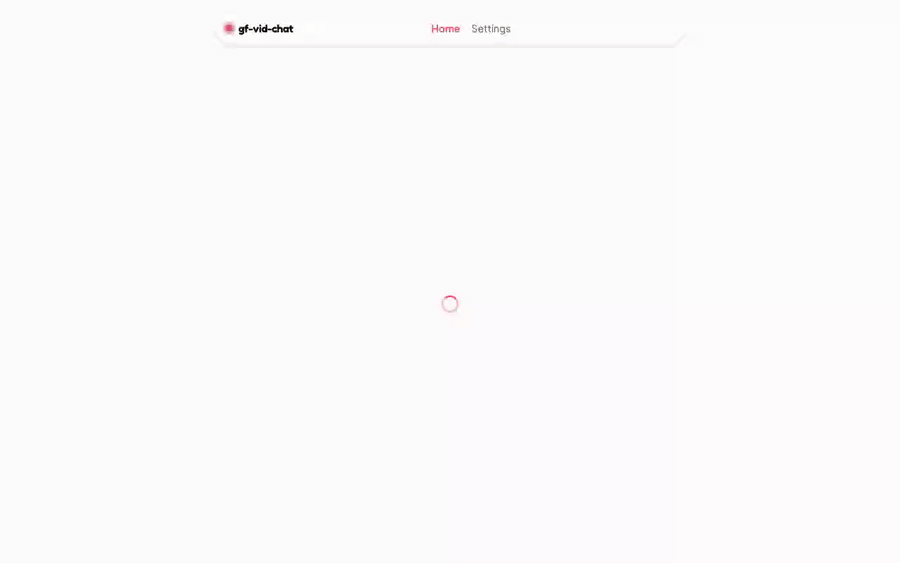
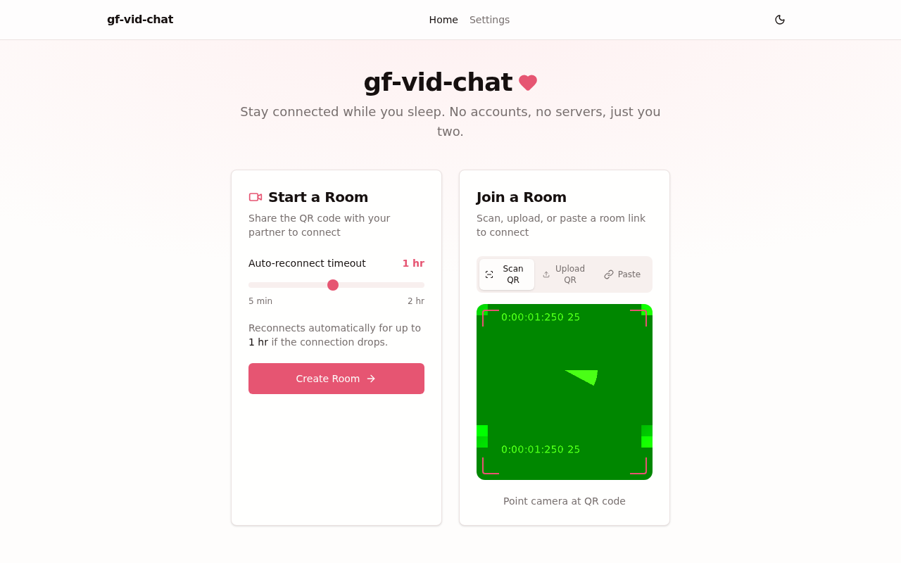
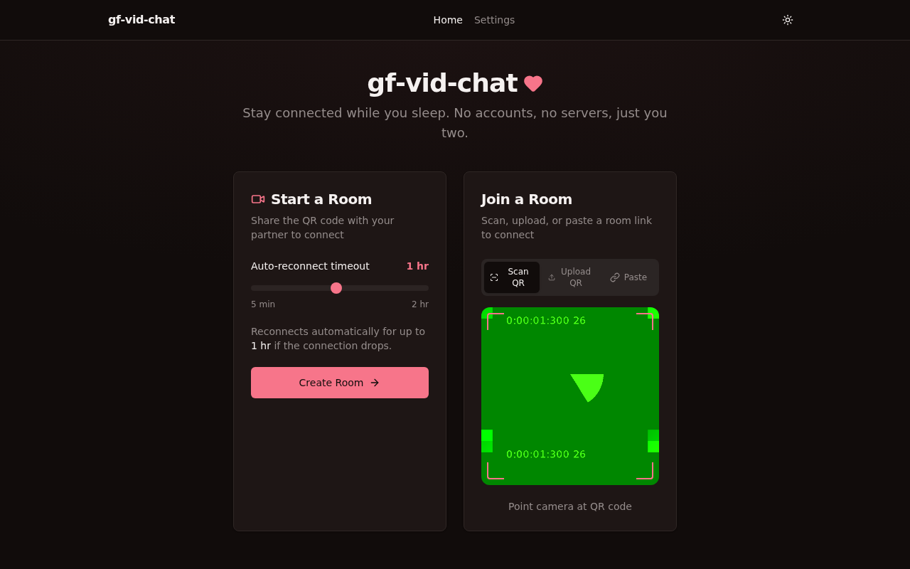
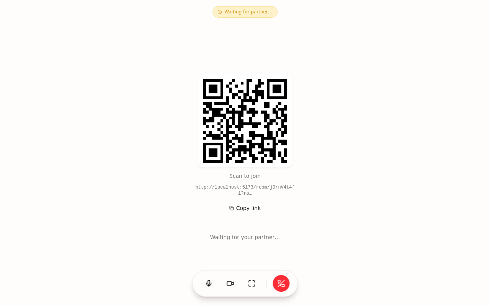
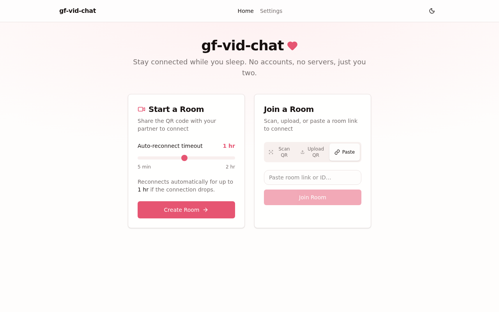
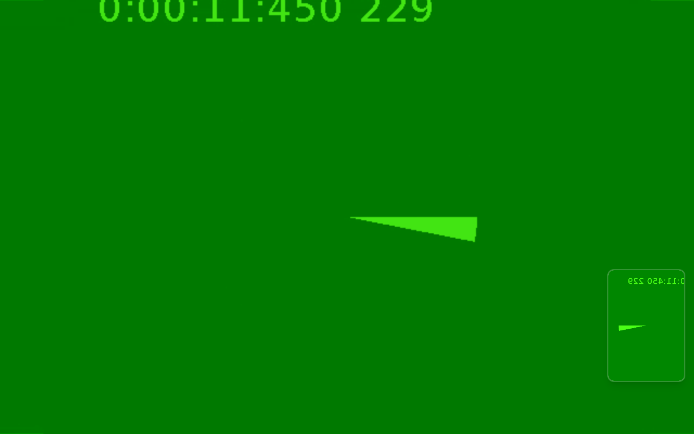
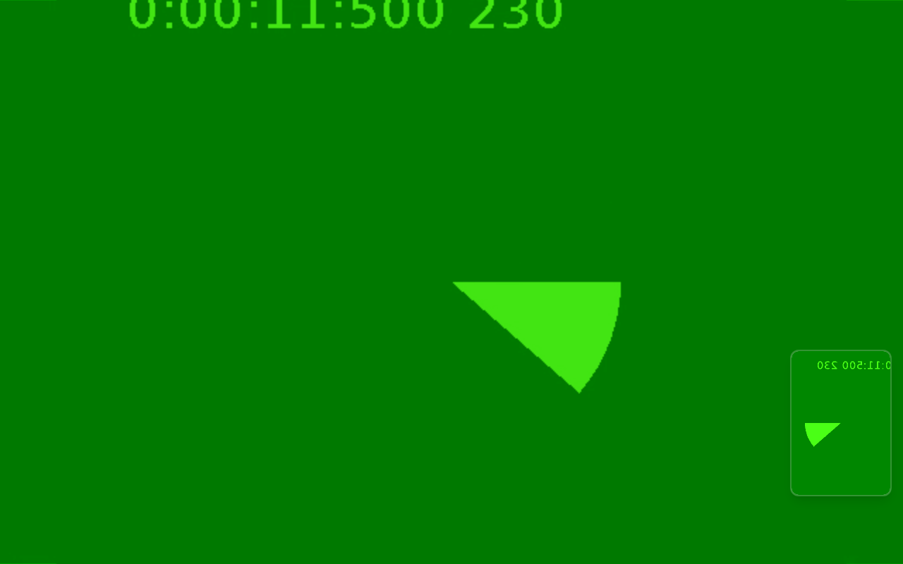
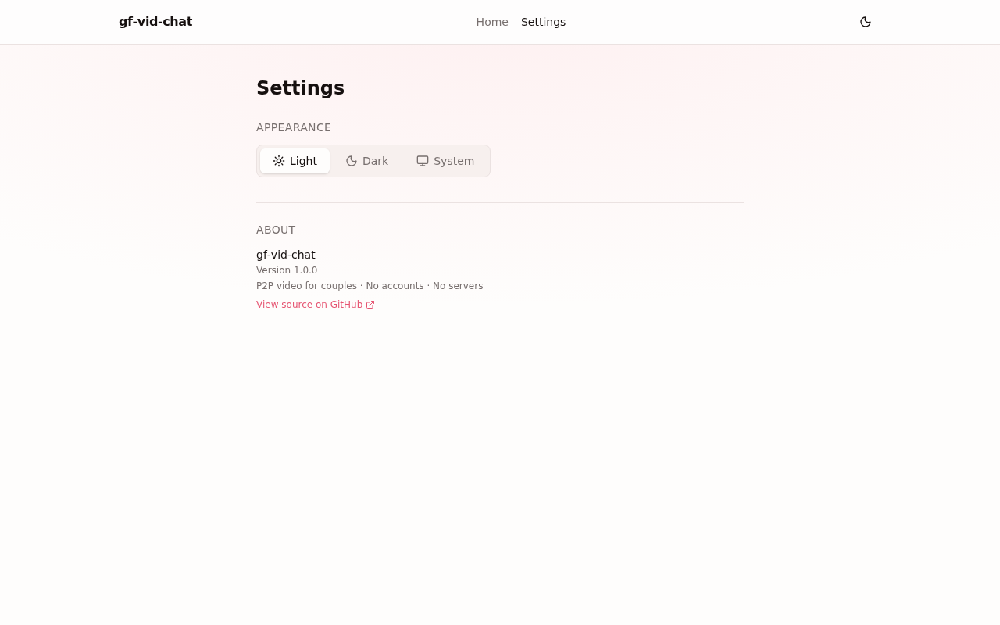
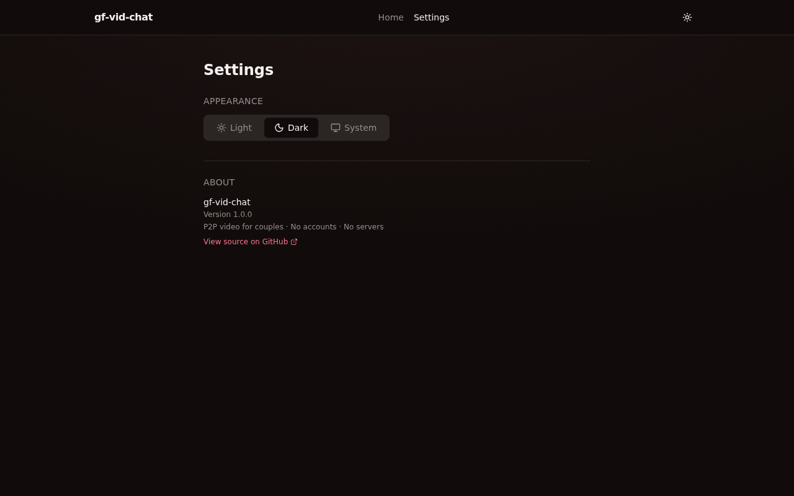

# gf-vid-chat

> Peer-to-peer video chat for couples — QR-code rooms, silent auto-reconnect, no accounts, no backend.

**Live:** [gf-vid-chat.vercel.app](https://gf-vid-chat.vercel.app) · **Source:** [github.com/carlomigueldy/gf-vid-chat](https://github.com/carlomigueldy/gf-vid-chat)

<p align="center">
  
</p>

A pure client-side video chat designed for one specific use case: staying connected while sleeping. Existing apps (Messenger, FaceTime) require ringing and manual acceptance — if your internet drops at 3am, someone has to wake up to reconnect. `gf-vid-chat` reconnects silently with exponential backoff for up to an hour by default.

## Why

- **No accounts.** Generate a room, share a QR code, done.
- **No backend.** PeerJS's free signaling server handles introductions; the call is true P2P over WebRTC.
- **Silent reconnect.** Network blips don't end the call — the state machine keeps retrying with backoff (1s → 30s cap) for a configurable timeout (default 1h).
- **One evening to ship.** Pure SPA, deployable on any static host.

## Features

- QR-code room joining: scan with camera, upload a screenshot, or paste a link.
- Auto-reconnect state machine with exponential backoff and full peer cleanup per retry.
- Light / dark / system theme with persistent preference.
- Mic / camera toggles, hang up, fullscreen.
- Mobile-friendly layout (full-screen remote video, picture-in-picture local).
- 100% client-side — no analytics, no telemetry, no data leaves the two browsers.

## Screenshots

| | |
|---|---|
|  |  |
| _Home — create or join_ | _Home — dark theme_ |
|  |  |
| _QR display while waiting for partner_ | _Join by pasting a room link_ |
|  |  |
| _Active call — creator side (full-screen remote + PiP local)_ | _Active call — joiner side_ |
|  |  |
| _Settings — light theme_ | _Settings — dark theme_ |

> Active-call screenshots show Chromium's synthetic camera test pattern (used to capture screenshots in CI). Real cameras render normally.

## Tech Stack

| Layer | Choice |
|---|---|
| Build | Vite 8 |
| Framework | React 19 + TypeScript |
| Styling | Tailwind v4 + shadcn/ui patterns |
| Animation | Framer Motion |
| Routing | react-router-dom v7 |
| WebRTC | PeerJS (`0.peerjs.com` signaling) |
| QR encode | `qrcode.react` |
| QR decode | `jsqr` (uploaded image) + `html5-qrcode` (camera scan) |
| IDs | `nanoid` |
| Tests | Vitest + Testing Library + Playwright |
| Deploy | Vercel (static) |

## Quick Start

```bash
pnpm install
pnpm dev
```

Open http://localhost:5173. To test P2P locally, open a second browser (or incognito window), create a room in one, scan/paste the link into the other.

## Scripts

```bash
pnpm dev            # Vite dev server
pnpm build          # tsc + vite production build
pnpm preview        # Preview the production build
pnpm test           # Vitest (unit + component)
pnpm test:watch     # Vitest watch mode
pnpm test:e2e       # Playwright end-to-end
pnpm test:e2e:ui    # Playwright UI mode
pnpm lint           # ESLint
pnpm type-check     # TypeScript without emit
```

## How It Works

### Room lifecycle

1. **Create** — Host generates a `nanoid` room ID, registers `gfvc-<id>` with PeerJS, renders a QR code containing the room URL.
2. **Join** — Guest scans/uploads the QR or pastes the link, opens the room URL, connects to peer ID `gfvc-<id>`.
3. **Call** — Both sides exchange `getUserMedia` streams over WebRTC. Direct P2P after ICE negotiation.
4. **Reconnect** — Any drop triggers cleanup → backoff → re-register → re-call, repeated until reconnected or timeout.

### Auto-reconnect state machine

Lives in `src/hooks/use-peer.ts`. Constants in `src/lib/peer-config.ts`:

```ts
INITIAL_BACKOFF_MS = 1000          // 1s first retry
MAX_BACKOFF_MS = 30000             // cap at 30s
BACKOFF_MULTIPLIER = 2             // exponential
DEFAULT_RETRY_TIMEOUT_MS = 3_600_000 // 1 hour total
```

On each retry the previous `Peer` and `MediaConnection` are fully torn down before a new one is created — partial state was the source of the trickiest bugs.

### STUN / TURN

Default config uses Google's public STUN servers. No TURN — if both peers are behind symmetric NAT the call may fail. Override `DEFAULT_PEER_CONFIG` in `src/lib/peer-config.ts` to add a TURN server (e.g. Cloudflare, Twilio, self-hosted coturn).

## Project Structure

```
src/
├── main.tsx                React root + BrowserRouter
├── App.tsx                 Routes + ThemeProvider + AnimatePresence
├── globals.css             Tailwind v4 + shadcn tokens
├── pages/
│   ├── home-page.tsx       Create or join
│   ├── room-page.tsx       Active call surface
│   └── settings-page.tsx   Theme + preferences
├── components/
│   ├── ui/                 shadcn primitives (button, card, badge, ...)
│   ├── layout/             header, page-container
│   ├── video/              video-player, video-grid, connection-status
│   ├── qr/                 qr-display, qr-scanner, qr-upload
│   └── room/               create-room, join-room, room-controls
├── hooks/
│   ├── use-peer.ts         Auto-reconnect state machine
│   ├── use-media-stream.ts getUserMedia + track toggle + cleanup
│   ├── use-connection-timer.ts retry countdown
│   └── use-theme.ts        light/dark/system
├── context/
│   └── theme-context.tsx
├── lib/
│   ├── peer-config.ts      PeerJS + STUN + backoff constants
│   ├── room-id.ts          nanoid + validation
│   ├── qr.ts               encode/decode helpers
│   ├── animations.ts       Framer Motion variants
│   └── utils.ts            cn() helper
└── types/index.ts          ConnectionState, RoomConfig, Theme
```

Routes:

| Path | Page |
|---|---|
| `/` | Create or join |
| `/room/:roomId` | Active call |
| `/settings` | Theme + preferences |

## Configuration

No environment variables. Everything is compile-time constants in `src/lib/peer-config.ts`. To customize:

- **Retry behaviour** — edit the backoff constants.
- **STUN/TURN servers** — edit `DEFAULT_PEER_CONFIG.config.iceServers`.
- **Peer ID prefix** — edit `PEER_ID_PREFIX` if you fork and want isolated namespaces from the default `gfvc-`.

## Testing

```bash
pnpm test           # unit + component (Vitest + Testing Library + jsdom)
pnpm test:e2e       # Playwright end-to-end
```

Component tests live next to their source as `*.test.tsx`. The reconnect state machine is the most-tested module — see `src/hooks/use-peer.ts` and `src/hooks/use-connection-timer.ts`.

## Deployment

Deployed as a static SPA on Vercel.

| Environment | URL |
|---|---|
| Production | <https://gf-vid-chat.vercel.app> |
| Project dashboard | <https://vercel.com/carlo-miguel-dys-projects/gf-vid-chat> |

Manual deploy:

```bash
pnpm build
vercel deploy --prod
```

`vercel.json` rewrites all routes to `index.html` so client-side routing works on direct URL hits. Any static host with SPA-fallback support works — Cloudflare Pages, Netlify, GitHub Pages — as long as `/(.*) → /index.html` is configured.

### Capturing fresh screenshots and the demo GIF

The screenshots and `docs/demo.gif` are regenerated with Playwright + ffmpeg:

```bash
pnpm dev                         # in one terminal
node scripts/capture-demo.mjs    # in another — uses Chromium fake media
# then re-encode the recording:
ffmpeg -y -i docs/recordings/demo-creator.webm \
  -vf "fps=12,scale=900:-1:flags=lanczos,palettegen=stats_mode=diff" /tmp/palette.png
ffmpeg -y -i docs/recordings/demo-creator.webm -i /tmp/palette.png \
  -lavfi "fps=12,scale=900:-1:flags=lanczos[x];[x][1:v]paletteuse=dither=bayer:bayer_scale=5:diff_mode=rectangle" \
  docs/demo.gif
```

## Development Workflow

This project follows a strict worktree + PR workflow (see `CLAUDE.md`):

- Never push to `main` directly. Open a PR from a worktree branch.
- Create worktrees with `git worktree add ../gf-vid-chat-<task> -b feat/<task>`.
- Commits use [Conventional Commits](https://www.conventionalcommits.org/): `feat:`, `fix:`, `chore:`, `docs:`, `refactor:`, `test:`, `ci:`, `perf:`.

## Status

v1 shipped — see merged PRs #1–#4. Active development continues on small features and polish.

## Acknowledgements

- [PeerJS](https://peerjs.com/) — the WebRTC bundle that makes a backend unnecessary.
- [shadcn/ui](https://ui.shadcn.com/) — design patterns adapted into the component library.
- [Tailwind CSS](https://tailwindcss.com/), [Framer Motion](https://www.framer.com/motion/), [Vite](https://vitejs.dev/).
